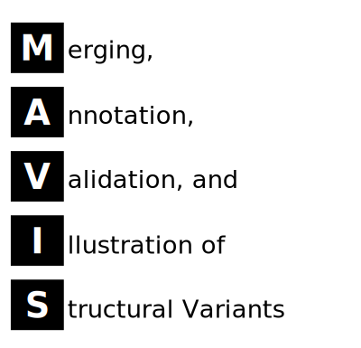

<object type='image/svg+xml' data='docs/images/acronym.svg'>
    <object type='image/svg+xml' data='images/acronym.svg'>
    	
    </object><br>
</object>

  [](https://codecov.io/gh/bcgsc/mavis) 

## About

[MAVIS](http://mavis.bcgsc.ca) is python command-line tool for the post-processing of structural variant calls.
The general [MAVIS](http://mavis.bcgsc.ca) pipeline consists of six main stages

- convert
- [cluster](https://mavis.readthedocs.io/en/latest/package/mavis/cluster)
- [validate](https://mavis.readthedocs.io/en/latest/package/mavis/validate)
- [annotate](https://mavis.readthedocs.io/en/latest/package/mavis/annotate)
- [pairing](https://mavis.readthedocs.io/en/latest/package/mavis/pairing)
- [summary](https://mavis.readthedocs.io/en/latest/package/mavis/summary)

## Getting Help

All steps in the MAVIS pipeline are called following the main mavis entry point. The usage menu can be viewed
by running without any arguments, or by giving the -h/--help option

``` bash
mavis -h
```

Help sub-menus can be found by giving the pipeline step followed by no arguments or the -h options

``` bash
mavis cluster -h
```

Common problems and questions are addressed on the [wiki](https://github.com/bcgsc/mavis/wiki/Help-and-Frequently-Asked-Questions).
If you have a question or issue that is not answered there (or already a github issue) please submit
a github issue to our [github page](https://github.com/bcgsc/mavis/issues) or contact us by email at [mavis@bcgsc.ca](mailto:mavis@bcgsc.ca)

## Getting Started

The simplest way to use MAVIS is via Singularity. The MAVIS docker container used
by singularity will take care of installing the aligner as well.

```bash
pip install -U setuptools pip
pip install mavis_config  # also installs snakemake
```

Now you will run mavis via Snakemake as follows

```bash
snakemake \
    -j <MAX JOBS> \
    --configfile <YOUR CONFIG> \
    --use-singularity \
    -s Snakefile
```

For other installation options which do not use docker/singularity see the comprehensive install
instructions in the [user manual](https://mavis.readthedocs.io/en/latest/install)

## Citation

If you use MAVIS as a part of your project please cite

[Reisle,C. et al. (2018) MAVIS: Merging, Annotation, Validation, and Illustration of Structural variants. Bioinformatics.](https://doi.org/10.1093/bioinformatics/bty621)
