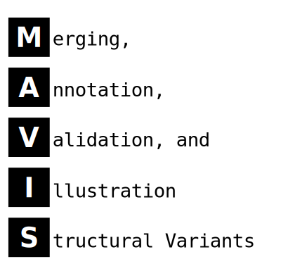

<object type='image/svg+xml' data='docs/source/_static/acronym.svg'>
    <object type='image/svg+xml' data='_static/acronym.svg'>
    	
    </object><br>
</object>


  


# About

[MAVIS](http://mavis.bcgsc.ca) is python command-line tool for the post-processing of structural variant calls.
The general [MAVIS](http://mavis.bcgsc.ca) pipeline consists of six main stages

- convert
- [cluster](http://mavis.bcgsc.ca/docs/latest/mavis.cluster.html#mavis-cluster)
- [validate](http://mavis.bcgsc.ca/docs/latest/mavis.validate.html#mavis-validate)
- [annotate](http://mavis.bcgsc.ca/docs/latest/mavis.annotate.html#mavis-annotate)
- [pairing](http://mavis.bcgsc.ca/docs/latest/mavis.pairing.html#mavis-pairing)
- [summary](http://mavis.bcgsc.ca/docs/latest/mavis.summary.html#mavis-summary)

## Getting Help

All steps in the MAVIS pipeline are called following the main mavis entry point. The usage menu can be viewed
by running without any arguments, or by giving the -h/--help option

``` bash
mavis -h
```

Help sub-menus can be found by giving the pipeline step followed by no arguments or the -h options

``` bash
mavis cluster -h
```

Common problems and questions are addressed on the [wiki](https://github.com/bcgsc/mavis/wiki/Help-and-Frequently-Asked-Questions).
If you have a question or issue that is not answered there (or already a github issue) please submit
a github issue to our [github page](https://github.com/bcgsc/mavis/issues) or contact us by email at [mavis@bcgsc.ca](mailto:mavis@bcgsc.ca)

## Install Instructions

There are 3 major steps to setting up and installing [MAVIS](http://mavis.bcgsc.ca). If you are a developer contributing to mavis, please see the [instructions for developers page](http://mavis.bcgsc.ca/docs/latest/development.html) instead

### 1. Install Aligner

In addition to the python package dependencies, [MAVIS](http://mavis.bcgsc.ca) also requires an aligner to be installed.
Currently the only aligners supported are [blat](http://mavis.bcgsc.ca/docs/latest/glossary.html#term-blat) and [bwa mem](http://mavis.bcgsc.ca/docs/latest/glossary.html#term-bwa).
For MAVIS to run successfully the aligner must be installed and accessible on the path.
If you have a non-standard install you may find it useful to edit the PATH environment variable. For example

``` bash
export PATH=/path/to/directory/containing/blat/binary:$PATH
```

[blat](http://mavis.bcgsc.ca/docs/latest/glossary.html#term-blat) is the default aligner. To configure MAVIS to use [bwa mem](http://mavis.bcgsc.ca/docs/latest/glossary.html#term-bwa) as a default instead, use the
[MAVIS environment variables](http://mavis.bcgsc.ca/configuration.html#environment-variables). Make sure to specify BOTH of the variables below to change the default aligner.

``` bash
export MAVIS_ALIGNER='bwa mem'
export MAVIS_ALIGNER_REFERENCE=/path/to/mem/fasta/ref/file
```

After this has been installed MAVIS itself can be installed through [pip](https://pypi.org/project/mavis/)

### 2. Install MAVIS

#### Install using pip

The easiest way to install [MAVIS](http://mavis.bcgsc.ca) is through the python package manager, pip. If you do not have python3 installed it can be found [here](https://www.python.org/downloads)

Ensuring you have a recent version of pip and setuptools will improve the install experience. Older versions of pip and setuptools may have issues with obtaining some of the mavis python dependencies

``` bash
pip install --upgrade pip setuptools
```

or (for Anaconda users)

``` bash
conda update pip setuptools
```

If this is not a clean/new python install it may be useful to set up mavis in a [virtual python environment](https://docs.python.org/3/tutorial/venv.html)

Then install mavis itself

``` bash
pip install mavis
```

This will install mavis and its python dependencies.

#### Install using Buildout

Alternatively you can use the [bootstrap/buildout](http://www.buildout.org/en/latest/) to install mavis into bin/mavis

``` bash
git clone https://github.com/bcgsc/mavis.git
cd mavis
pip install zc.buildout
python bootstrap.py
bin/buildout
```

This will install mavis and its python dependencies into eggs inside the cloned mavis directory which can be used by simply running bin/mavis

### 3. Build or Download Reference Files

After [MAVIS](http://mavis.bcgsc.ca) is installed the [reference files](http://mavis.bcgsc.ca/docs/latest/mavis_input.html#reference-input-files) must be generated (or downloaded) before it can be run. A simple bash script to download the hg19 reference files and generate a MAVIS environment file is provided under mavis/tools for convenience.

``` bash
cd /path/to/where/you/want/to/put/the/files
wget https://raw.githubusercontent.com/bcgsc/mavis/master/tools/get_hg19_reference_files.sh
bash get_hg19_reference_files.sh
source reference_inputs/hg19_env.sh
```

Once the above 3 steps are complete [MAVIS](http://mavis.bcgsc.ca) is ready to be run.
See the MAVIS [tutorial](http://mavis.bcgsc.ca/docs/latest/pipeline.html#mavis-mini-tutorial) to learn about running MAVIS.


## Citation

If you use MAVIS as a part of your project please cite

[Reisle,C. et al. (2018) MAVIS: Merging, Annotation, Validation, and Illustration of Structural variants. Bioinformatics.](https://doi.org/10.1093/bioinformatics/bty621)
