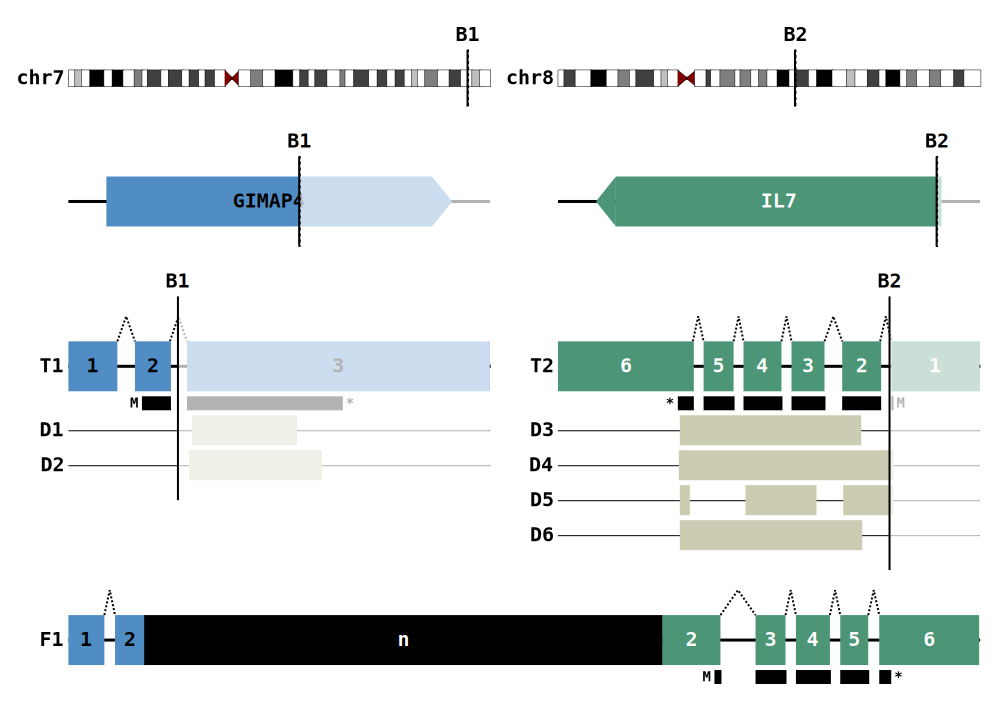
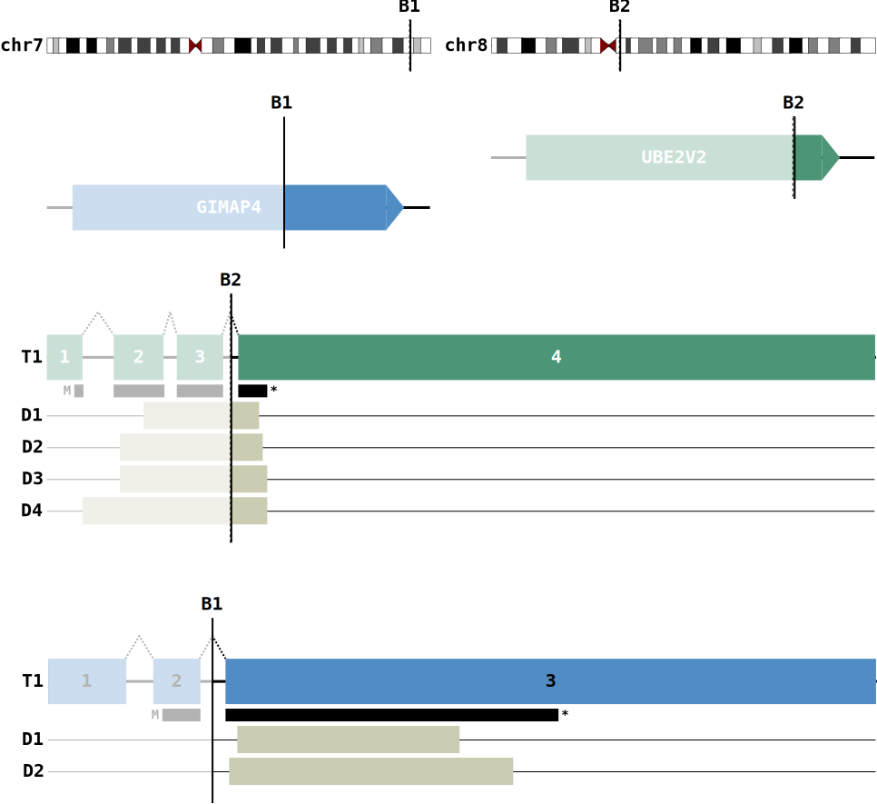

Illustrations
----------------

Fusion Diagrams
.................

These are diagrams produced during the annotate step. These represent the putative fusion events of a 
single breakpoint pair.

    Fusion from transcriptome data. Intronic breakpoints here indicate retained intron sequence and
    a novel exon is predicted.

If the :term:`draw_fusions_only` flag is set to False then all events will produce
a diagram, even anti-sense fusions

    Disruptive Anti-sense Fusion

Transcript Overlays
.....................

MAVIS supports generating diagrams of all transcripts for a given gene. These
can be overlaid with markers and bam_file pileup data. This is particularly 
useful for visualizing splice site mutations.

.. figure:: _static/ENSG00000139687_RB1_overlay.png
    :width: 100%

    RB1 splice site mutation results in skipping of exon 9

The above diagram was generated using the overlay command

.. code:: bash

    mavis overlay RB1 \
        -o /path/to/output/dir \
        --read_depth_plot rna /path/to/bam/file \
        --marker M1 48939029 \
        --annotations /path/to/mavis/annotations/reference/file
