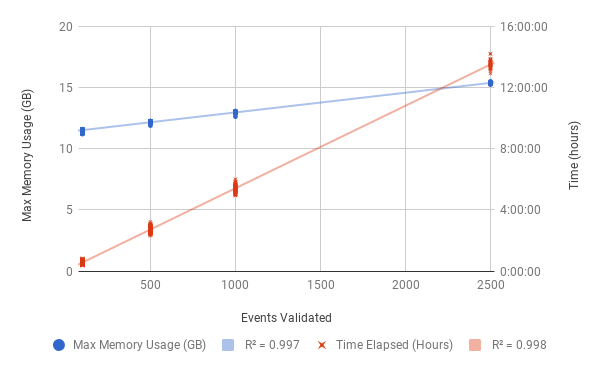

.. _resource-requirements:

Resource Requirements
===========================

MAVIS has been tested on both unix and linux systems. For the standard pipeline, the validation stage is
the most computationally expensive. The memory and cpu requirements will vary with two main factors: the number
of structural variants you are validating per job, and the size of the bam file you are validating against.

There are a number of settings that can be adjusted to reduce memory and cpu requirements depending on what the user is trying to analyze.
See :ref:`configuration and settings <configuration-and-settings>` for more details.

Validation Resources
-----------------------

    Resource Requirements (MAVIS 1.8.0) for each validation job of the COLO829 tumour genome. The BAM file for the tumour genome is 127GB. Validation jobs were
    tested splitting into: 100, 500, 1000, and 2500 structural variant validations per job. The effect of number of events validated on both
    memory and time is plotted above.

Annotation Resources
----------------------

Similar trends were observed for the annotation step (see below) with regards to time elapsed. However the memory requirements remained more constant which is expected since,
unlike validation, anntotation does not read more data in for more events.

.. figure:: _static/colo829_tumour_annotation_resource_req.png
    :width: 100%

    Resource Requirements (MAVIS 1.8.0) for each annotation job of the COLO829 tumour genome.
    The events which passed validation (see above) represent the number of events input to the annotation step.

