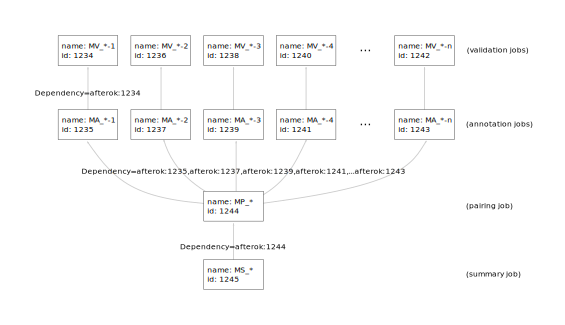

.. _pipeline:

Running the Pipeline
========================

Running MAVIS using a Job Scheduler
---------------------------------------

The setup step of MAVIS is set up to use a :ref:`dep-job-schedulers` job scheduler on a compute cluster.
will generate submission scripts and a wrapper bash script for the user to execute on their cluster head node.

.. figure:: _static/pipeline_options.svg
    :width: 100%

    The MAVIS pipeline is highly configurable. Some pipeline steps (cluster, validate) are optional and can be automatically skipped.
    The standard pipeline is far-left.

The most common use case is :ref:`auto-generating a configuration file <pipeline-config>` and then running the pipeline setup step.
The pipeline setup step will run clustering and create scripts for running the other steps.

.. code:: bash

    mavis config .... -w config.cfg
    mavis setup config.cfg -o /path/to/top/output_dir

This will create the build.cfg configuration file, which is used by the scheduler to submit jobs. To use a particular scheduler you
will need to set the `MAVIS_SCHEDULER` environment variable. After the build configuration file has been created you can run the mavis
schedule option to submit your jobs

.. code:: bash

    ssh cluster_head_node
    mavis schedule -o /path/to/output_dir --submit

This will submit a series of jobs with dependencies.

.. _pipeline-dependency-graph:

    Dependency graph of MAVIS jobs for the standard pipeline setup. The notation on the arrows indicates the
    SLURM setting on the job to add the dependency on the previous job.

Configuring Scheduler Settings
.................................

There are multiple ways to configure the scheduler settings. Some of the configurable options are listed below

- :term:`queue` ``MAVIS_QUEUE``
- :term:`memory_limit` ``MAVIS_MEMORY_LIMIT``
- :term:`time_limit` ``MAVIS_TIME_LIMIT``
- :term:`import_env` ``MAVIS_IMPORT_ENV``
- :term:`scheduler` ``MAVIS_SCHEDULER``

For example to set the job queue default using an :ref:`environment variable <config-environment>`

.. code:: bash

    export MAVIS_QUEUE=QUEUENAME

Or it can also be added to the config file manually

::

    [schedule]
    queue = QUEUENAME

Troubleshooting Dependency Failures
.....................................

The most common error to occur when running MAVIS on the cluster is a memory or time limit exception.
These can be detected by running the schedule step or looking for dependency failures reported on the cluster.
The suffix of the job name will be a number and will correspond to the suffix of the job directory.

.. code:: bash

    mavis schedule -o /path/to/output/dir

This will report any failed jobs. For example if this were a crash report for one of the validation jobs we might expect to see something like below in the schedule output

::

    [2018-05-31 13:02:06] validate
                            MV_<library>_<batch id>-<task id> (<job id>) is FAILED
                              CRASH: <error from log file>

Any jobs in an error, failed, etc. state can be resubmitted by running mavis schedule with the resubmit flag

.. code:: bash

    mavis schedule -o /path/to/output/dir --resubmit

If a job has failed due to memory or time limits, editing the ``/path/to/output/dir/build.cfg`` file can allow the user to change a job without resetting up and rerunning the other jobs.
For example, below is the configuration for a validation job

::

    [MV_mock-A47933_batch-D2nTiy9AhGye4UZNapAik6]
    stage = validate
    job_ident = 1691742
    name = MV_mock-A47933_batch-D2nTiy9AhGye4UZNapAik6
    dependencies =
    script = /path/to/output/dir/mock-A47933_diseased_transcriptome/validate/submit.sh
    status = FAILED
    output_dir = /path/to/output/dir/mock-A47933_diseased_transcriptome/validate/batch-D2nTiy9AhGye4UZNapAik6-{task_ident}
    stdout = /path/to/output/dir/mock-A47933_diseased_transcriptome/validate/batch-D2nTiy9AhGye4UZNapAik6-{task_ident}/job-{name}-{job_ident}-{task_ident}.log
    created_at = 1527641526
    status_comment =
    memory_limit = 18000
    queue = short
    time_limit = 57600
    import_env = True
    mail_user =
    mail_type = NONE
    concurrency_limit = None
    task_list = 1
        2
        3

The memory_limit is in Mb and the time_limit is in seconds. Editing the values here will cause the job to be resubmitted with the new values.

.. warning::

    Incorrectly editing the build.cfg file may have unanticipated results and require re-setting up MAVIS to fix.
    Generally the user should ONLY edit ``memory_limit`` and ``time_limit`` values.

If memory errors are frequent then it would be better to adjust the default values (:term:`trans_validation_memory`, :term:`validation_memory`, :term:`time_limit`)

.. include:: tutorial.rst

