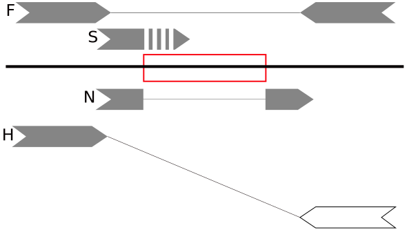
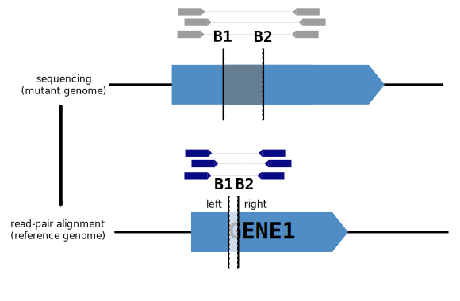
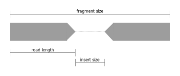
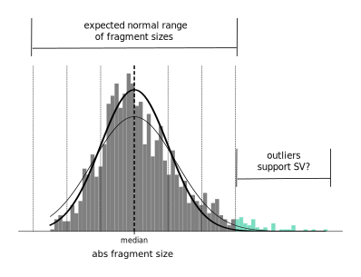
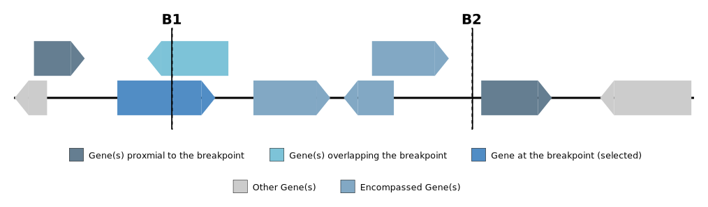
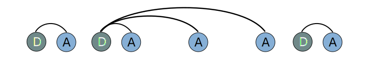

Theory and Models
--------------------

Introduction
++++++++++++++

In MAVIS structural variants (SVs) are defined by a pair of breakpoints

And a breakpoint is defined by

1. chromosome
2. base-pair range (start, end). This has a length of 1 for exact calls and more for uncertain/non-specific calls
3. :term:`orientation`\ . This is Left or Right with respect to the positive/forward strand. This defines which portion of the genome is ‘retained’
4. :term:`strand`\ . (only applicable to stranded transcriptome libraries)

So then a breakpoint pair is any two intervals on the reference genome which are adjacent in the mutant genome

|

-----------------

|

Evidence
++++++++++++

There are many ways that single reads or paired-end reads can act as support for an SV call.

    In the figure above
    the red rectangle represents a deletion structural variant. The arrows are types of single or paired-end reads supporting
    the event: :term:`flanking read pair`\ s (F), :term:`split read`\ s (S), :term:`half-mapped read`\ s (H),
    and :term:`spanning read`\ s (N).

.. _theory-types-of-flanking-evidence:

Types of Flanking evidence
......................................

One of the most confusing parts about working with contig and paired-end reads is relating them to the
breakpoint so that you can determine which types will support an event. The flanking read types we outline here
are similarly described by `IGV <http://software.broadinstitute.org/software/igv/interpreting_insert_size>`_.
We have used similar coloring for the read pairs in the following diagrams to
facilitate ease of use for those already familiar with viewing bam files in IGV.

.. note::

    The major assumptions here are that the 'normal' read-pair is a read pair which has one read on the positive/forward
    strand and its partner on the negative/reverse strand. It is assumed that partners share a read name, as is the case for Illumina reads.

Deletion
,,,,,,,,,

For a deletion, we expect the flanking reads to be in the normal orientation but that the
fragment size should be abnormal (for large deletions).

.. figure:: _static/read_pairs_deletion.svg
    :width: 100%

    Flanking read pair evidence for a deletion event. the read pairs will have a larger than expected fragment size when mapped to the
    reference genome because in the mutant genome they are closer together, owing to the deletion event. (B1) The first breakpoint
    which has a left orientation. (B2) The second breakpoint which has a right orientation. Both breakpoints would be on the positive
    strand (assuming that the input is stranded) which means that the first read in the pair would be on the positive strand and the
    second read in the pair would be on the negative/reverse strand.

Insertion
,,,,,,,,,,

    Flanking read pair evidence for an insertion event. The read pairs will have a smaller than expected fragment size when mapped to the
    reference genome because in the mutant genome they are father apart, owing to the insertion event. (B1) The first breakpoint
    which has a left orientation. (B2) The second breakpoint which has a right orientation. Both breakpoints would be on the positive
    strand (assuming that the input is stranded) which means that the first read in the pair would be on the positive strand and the
    second read in the pair would be on the negative/reverse strand.

Duplication
,,,,,,,,,,,,,

.. figure:: _static/read_pairs_duplication.svg
    :width: 100%

    Flanking read pair evidence for a tandem duplication event. The read pairs will have an abnormal orientation but still the
    same strands as the normal read pair. (B1) The first breakpoint will be on the positive strand and have a right orientation.
    (B2) The second breakpoint will be on the positive strand and have a left orientation.

Inversion
,,,,,,,,,,

.. figure:: _static/read_pairs_inversion_LL.svg
    :width: 100%

    Flanking read pair evidence for an inversion. Both breakpoints have left orientation.

.. figure:: _static/read_pairs_inversion_RR.svg
    :width: 100%

    Flanking read pair evidence for an inversion. Both breakpoints have right orientation.

Translocation
,,,,,,,,,,,,,,

.. figure:: _static/read_pairs_translocation_LR.svg
    :width: 100%

    Flanking read pair evidence for a translocation. (B1) the first breakpoint with a left orientation. (B2) the second breakpoint with a right orientation.

.. figure:: _static/read_pairs_translocation_RL.svg
    :width: 100%

    Flanking read pair evidence for a translocation. (B1) the first breakpoint with a right orientation. (B2) the second breakpoint with a left orientation.

Inverted Translocation
,,,,,,,,,,,,,,,,,,,,,,,,

.. figure:: _static/read_pairs_translocated_inversion_LL.svg
    :width: 100%

    Flanking read pair evidence for an inverted translocation. Both breakpoints have left orientation.

.. figure:: _static/read_pairs_translocated_inversion_RR.svg
    :width: 100%

    Flanking read pair evidence for an inverted translocation. Both breakpoints have right orientation.

|

------

|

.. _theory-compatible-flanking-pairs:

Compatible Flanking Pairs
......................................

For insertion and duplication events compatible flanking pairs are collected. This means that flanking pairs that
support a duplication may be used as compatible flanking evidence for an insertion (in the same region) and similarly
flanking pairs which support an insertion may be compatible flanking evidence for a duplication

.. figure:: _static/compatible_flanking_pairs.svg
    :width: 100%

    The event depicted above may be called as either a duplication or an insertion (depending on the input call). If
    the even were called as a duplication the reads in green would be the flanking supoprt and the reads in blue
    would be given as compatible flanking support. If the event were called as an insertion the reverse would apply.

|

------

|

.. _theory-calculating-the-evidence-window:

Calculating the Evidence Window
......................................

    Basic Terms used in describing read pairs are shown above: fragment size: the distance between the pair;
    read length: the length of the read; fragment size: the combined length of both reads and the fragment size

We make some base assumptions with regards to paired-end read data:

.. note::

    the distribution of fragment sizes approximately follows a normal distribution

.. note::

    the most common fragment size is the unmutated 'normal' fragment

With the above assumptions we take the median fragment size to be the expected normal.

Given that we expect mutations and therefore abnormal fragment sizes, we use a modified method to calculate the
**median standard deviation** (see code below). We calculate the squared distance away from the
median for each fragment and then take a fraction of this to be 'normal' variation. So the most abnormal portion is
ignored, assuming it is supposed to be abnormal. This results in a calculation as follows.

.. code:: python

    from statistics import median
    import math

    fragments = [abs(read.template_length) for read in reads]  # the fragment sizes of the reads
    f = 0.95 # fraction
    m = median(fragments) # get the median fragment size value
    X = [math.pow(i - m, 2) for i in fragments]  # take the square error for each point
    end = int(round(len(X) * f))
    X = sorted(X)[0:end]
    stdev = math.sqrt(sum(X) / len(X))

This gives us an idea of when to judge an fragment size as abnormal and where we expect our normal read
pairs fragment sizes to fall.

    Distribution of fragment sizes (absolute values) of proper read pairs. The black curve representings the fit for
    a normal distribution using the standard deviation calculated with all data points. The blue curve is the expected
    distribution using a 0.95 fraction of the data. The thick vertical black line is the median and the thin black
    lines are standard deviations away from the median.

As we can see from the diagram above, removing the outliers reproduces the observed distribution better than using
all data points

We use this in two ways

1. to find flanking evidence supporting deletions and insertions
2. to estimate the window size for where we will need to read from the bam when looking for evidence for a given event

The :py:func:`~mavis.validate.evidence.GenomeEvidence._generate_window` function uses the above concepts.
The user will define the ``median_fragment_size`` the ``stdev_fragment_size`` , and the ``stdev_count_abnormal``
parameters defined in the :class:`~mavis.constants.VALIDATION_DEFAULTS` class.

If the library has a transcriptome protocol this becomes a bit more complicated and we must take into account the
possible annotations when calculating the evidence window. see
:py:func:`~mavis.validate.evidence.TranscriptomeEvidence._generate_window` for more

|

-----------------

|
.. _theory-calling-breakpoints-by-flanking-evidence:

Calling Breakpoints by Flanking Evidence
..........................................

Breakpoints are called by contig, split-read, or flanking pairs evidence. Contigs and split reads are used to call exact
breakpoints, where breakpoints called by flanking reads are generally assigned a probabilistic range.

The metrics used here are similar to those used in calculating the evidence window. We use the
:term:`max_expected_fragment_size` as the outer limit of how large the range can be. This is further refined taking
into account the range spanned by the :term:`flanking read pair` evidence and the position of the opposing breakpoint.

.. figure:: _static/call_breakpoint_by_flanking_reads.svg
    :width: 100%

    Calculation of the left-oriented breakpoint by flanking reads. Reads mapped to the breakpoint are shown in grey.
    The read on the right (black outline, no fill) demonstrates the read length used to narrow the right side bound of
    the estimated breakpoint interval.

|

-----------------

|

.. _theory-determining-flanking-support:

Determining Flanking support
..............................

.. figure:: _static/flanking_pairs_fragment_sizes_deletion.svg
    :width: 100%

    After a breakpoint has been called we can narrow the interval of expected fragment sizes using the
    size of the event. (Left) The colored portion of the graph represents the range in fragment sizes we
    expect for a normal/unmutated genome. (Right) For a deletion event we expect the fragment size to be bigger,
    outside the normal range. Reads that would flank the breakpoint should follow a similar distribution
    to the normal genome but the median will be shifted by the size of the event. The shaded portion of the
    graph represents the range in fragment sizes we expect for flanking pairs supporting the deletion event.

|

-----------------

|

.. _theory-classifying-events:

Classifying Events
++++++++++++++++++++

The following decision tree is used in classifying events based on their breakpoints. Only valid combinations have
been shown. see :py:func:`~mavis.breakpoint.BreakpointPair.classify`

.. figure:: _static/classification_tree.svg
    :width: 100%

    Classification Decision Tree. The above  diagram details the decsion logic for classifying events based on the
    orientation, strand and chromosomes or their respective breakpoints

|

-----------------

|

.. _theory-assembling-contigs:

Assembling Contigs
++++++++++++++++++++

During validation, for each breakpoint pair, we attempt to assemble a contig to represent the sequence across
the breakpoints. This is assembled from the supporting reads (:term:`split read`, :term:`half-mapped read`,
:term:`flanking read pair`, and :term:`spanning read`) which have already been collected for the given
event. The sequence from each read and its reverse complement are assembled into contigs using a :term:`DeBruijn graph`.
For strand specific events, we then attempt to resolve the sequence strand of the contig.

|

------

|

.. _theory-annotating-events:

Annotating Events
+++++++++++++++++++

We make the following assumptions when determining the annotations for each event

.. note::

    If both breakpoints are in the same gene, they must also be in the same transcript

.. note::

    If the breakpoint intervals overlap we do not annotate encompassed genes

.. note::

    Encompassed and 'nearest' genes are reported without respect to strand

There are specific questions we want annotation to answer. We collect gene level
annotations which describes things like what gene is near the breakpoint (useful
in the case of a potential promoter swap); what genes (besides the one selected)
also overlap the breakpoint; what genes are encompassed between the breakpoints
(for example in a deletion event the genes that would be deleted).

    Gene level annotations at each breakpoint. Note: genes which fall
    between a breakpoint pair, encompassed genes, will not be present for
    interchromosomal events (translocations)

Next there are the fusion-product level annotations. If the event result in a fusion
transcript, the sequence of the fusion transcript is computed. This is translated
to a putative amino acid sequence from which protein metrics such as the possible
ORFs and domain sequences can be computed.

|

-----------------

|

.. _theory-predicting-splicing-patterns:

Predicting Splicing Patterns
++++++++++++++++++++++++++++++

After the events have been called and an annotation has been attached, we often want to predict information about the
putative fusion protein, which may be a product. In some cases, when a fusion transcript disrupts a splice-site, it is
not clear what the processed fusion transcript may be. MAVIS will calculate all possibilities according to the
following model.

.. figure:: _static/splicing_pattern_default.svg
    :width: 100%

    The default splicing pattern is a list of pairs of donor and acceptor splice sites

For a given list of non-abrogated splice sites (listed 5' to 3' on the strand of the transcript) donor splice sites
are paired with all following as seen below

.. figure:: _static/splicing_pattern_multiple_donors.svg
    :width: 100%

    Multiple abrogated acceptors sites. As one can see above this situation will result in 3 different splicing
    patterns depending on which donor is paired with the 2nd acceptor site

    Multiple abrogated donor sites. As one can see above this situation will result in 3 different splicing
    patterns depending on which acceptor is paired with the 2nd donor site

More complex examples are drawn below. There are five classifications (:class:`~mavis.constants.SPLICE_TYPE`) for the different splicing patterns:

1. Retained intron (:class:`~mavis.constants.SPLICE_TYPE.RETAIN`)
2. Skipped exon (:attr:`~mavis.constants.SPLICE_TYPE.SKIP`)
3. Multiple retained introns (:attr:`~mavis.constants.SPLICE_TYPE.MULTI_RETAIN`)
4. Multiple skipped exons (:attr:`~mavis.constants.SPLICE_TYPE.MULTI_SKIP`)
5. Some combination of retained introns and skipped exons (:attr:`~mavis.constants.SPLICE_TYPE.COMPLEX`)

.. figure:: _static/splicing_model.svg
    :width: 100%

    Splicing scenarios

|

-----------------

|

.. _theory-pairing-similar-events:

Pairing Similar Events
++++++++++++++++++++++++

After breakpoints have been called and annotated we often need to see if the same event was found in different samples. To do this we will need to compare events between genome and transcriptome libraries. For this, the following model is proposed. To compare events between different protocol (genome vs transcriptome) we use the annotation overlying the genome breakpoint and the splicing model we defined above to predict where we would expect to find the transcriptomic breakpoints. This gives rise to the following basic cases.

.. note::
    In all cases the predicted breakpoint is either the same as the genomic breakpoint, or it is the same as the nearest retained donor/acceptor to the breakpoint.

.. figure:: _static/breakpoint_prediction_exonic.svg
    :width: 100%

    (A-D) The breakpoint lands in an exon and the five prime portion of the transcript is retained. (A) The original
    splicing pattern showing the placement of the genomic breakpoint and the retained five prime portion. (B) The first
    splice site following the breakpoint is a donor and the second donor is used. (C) The first splice site following the
    breakpoint is a donor and the first donor is used. (D) The first splice site following the breakpoint is an acceptor.
    (E-H) The breakpoint lands in an exon and the three prime portion of the transcript is retained. (E) The original
    splicing pattern showing the placement of the genomic breakpoint and the retained three prime portion. (F) The first
    splice site prior to the breakpoint is an acceptor and the first acceptor is used. (G) The first splice site prior to the
    breakpoint is an acceptor and the second acceptor is used. (H) The first splice site prior to the breakpoint is a donor

.. include:: citations.rst
